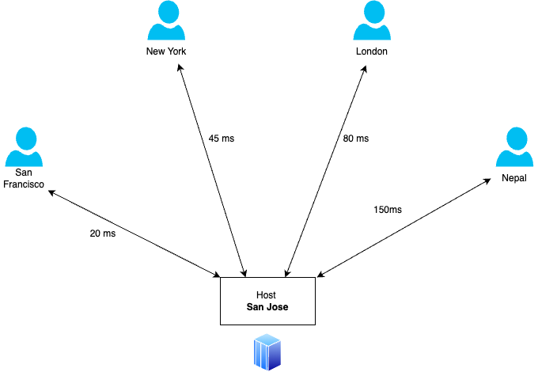

# Content Delivery Network
A CDN in a service that accelerates Content Delivery Network.
- It makes your website faster

A Content Delivery Network (CDN) is a distributed network of servers strategically located across various geographic locations to deliver digital content (such as web pages, images, videos, and other assets) to users more efficiently and reliably. CDNs are designed to reduce latency, increase speed, and improve the overall user experience by serving content from the server that is closest to the end-user's physical location.

## Case Study
For the below given case, if the webservice for an organization has been hosted on a server which is hosted at a server in San Jose. If you analyse the situation, as we move further away from the host, the latancy of the request (amount of time for a request to reach the server and back) increases. 

### Problem
1. Uneven Latency Across Users:
- Users close to the server (e.g., San Francisco) enjoy faster response times.
- Users farther from the server (e.g., Nepal) face significantly longer delays, leading to a degraded experience.

2. Decreased User Satisfaction:
- Users in Nepal or London may abandon the service due to slow page loads or interactions, impacting business goals like engagement and revenue.

3. Scalability Challenges:
If traffic from regions like New York or Nepal increases, the San Jose server might become overwhelmed, impacting performance for all users.

### Solution
A Content Delivery Network (CDN) can solve these issues by deploying edge servers in multiple regions. Here’s how it would work:

1. Edge Servers:
- A CDN places servers closer to end-users, such as in San Francisco, New York, London, and a nearby location for Nepal (e.g., Singapore or India).
- Cached content is served from these edge servers instead of the central San Jose host.
2. Latency Reduction:
- San Francisco: Served from a nearby edge server (e.g., 10 ms latency).
- New York: Served from an edge server on the East Coast (e.g., 10 ms latency).
- London: Served from an edge server in Europe (e.g., 15 ms latency).
- Nepal: Served from an edge server in Asia (e.g., 20 ms latency).
3. Load Balancing:
- Traffic is distributed among multiple edge servers, preventing the San Jose host from becoming a bottleneck.
4. Faster User Experience:
- All users, regardless of location, experience faster load times and consistent performance.